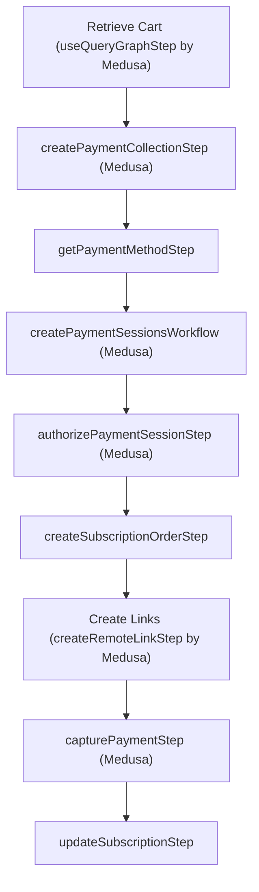

---
products:
  - order
  - payment
  - cart
  - customer
---

import { Github, PlaySolid, EllipsisHorizontal } from "@medusajs/icons"
import { Prerequisites, InlineIcon } from "docs-ui"

export const metadata = {
  title: `Subscriptions Recipe`,
}

# {metadata.title}

In this guide, you'll learn how to support subscription purchases with Medusa.

When you install a Medusa application, you get a fully-fledged commerce platform with support for customizations. While Medusa doesn't provide subscription-based purchases natively, it provides the Framework to support you in implementing this feature.

In this guide, you'll customize Medusa to implement subscription-based purchases with the following features:

1. Subscription-based purchases for a specified interval (monthly or yearly) and period.
2. Customize the admin dashboard to view subscriptions and associated orders.
3. Automatic renewal of the subscription.
4. Automatic subscription expiration tracking.
5. Allow customers to view and cancel their subscriptions.

This guide uses Stripe as an example to capture the subscription payments. You're free to use a different payment provider or implement your payment logic instead.

<Note>

This guide provides an example of an approach to implement subscriptions. You're free to choose a different approach using the Medusa Framework.

</Note>

<CardList items={[
  {
    href: "https://github.com/medusajs/examples/tree/main/subscription",
    title: "Subscription Example Repository",
    text: "Find the full code for this recipe example in this repository.",
    icon: Github,
  },
  {
    href: "https://res.cloudinary.com/dza7lstvk/raw/upload/v1721125608/OpenApi/Subscriptions_OpenApi_b371x4.yml",
    title: "OpenApi Specs for Postman",
    text: "Import this OpenApi Specs file into tools like Postman.",
    icon: PlaySolid,
  },
]} />

---

## Step 1: Install a Medusa Application

<Prerequisites items={[
  {
    text: "Node.js v20+",
    link: "https://nodejs.org/en/download"
  },
  {
    text: "Git CLI tool",
    link: "https://git-scm.com/downloads"
  },
  {
    text: "PostgreSQL",
    link: "https://www.postgresql.org/download/"
  }
]} />

Start by installing the Medusa application on your machine with the following command:

```bash
npx create-medusa-app@latest
```

You'll first be asked for the project's name. Then, when you're asked whether you want to install the Next.js Starter Storefront, choose `Y` for yes.

Afterwards, the installation process will start, which will install the Medusa application in a directory with your project's name, and the Next.js Starter Storefront in a directory with the `{project-name}-storefront` name.

<Note title="Why is the storefront installed separately?">

The Medusa application is composed of a headless Node.js server and an admin dashboard. The storefront is installed or custom-built separately and connects to the Medusa application through its REST endpoints, called [API routes](!docs!/learn/fundamentals/api-routes). Learn more about Medusa's architecture in [this documentation](!docs!/learn/introduction/architecture).

</Note>

Once the installation finishes successfully, the Medusa Admin dashboard will open with a form to create a new user. Enter the user's credentials and submit the form.

Afterwards, you can log in with the new user and explore the dashboard. The Next.js Starter Storefront is also running at `http://localhost:8000`.

<Note title="Ran into Errors?">

Check out the [troubleshooting guides](../../../../troubleshooting/create-medusa-app-errors/page.mdx) for help.

</Note>

---

## Step 2: Configure Stripe Module Provider

As mentioned in the introduction, you'll use Stripe as the payment provider for the subscription payments. In this step, you'll configure the [Stripe Module Provider](../../../../commerce-modules/payment/payment-provider/stripe/page.mdx) in your Medusa application.

<Prerequisites items={[
  {
    text: "Stripe account",
    link: "https://stripe.com/"
  },
  {
    text: "Stripe Secret API Key",
    link: "https://support.stripe.com/questions/locate-api-keys-in-the-dashboard"
  },
]} />

To add the Stripe Module Provider to the Medusa configurations, add the following to the `medusa-config.ts` file:

```ts title="medusa-config.ts"
module.exports = defineConfig({
  // ...
  modules: [
    {
      resolve: "@medusajs/medusa/payment",
      options: {
        providers: [
          {
            resolve: "@medusajs/medusa/payment-stripe",
            id: "stripe",
            options: {
              apiKey: process.env.STRIPE_API_KEY,
            },
          },
        ],
      },
    },
  ],
})
```

The Medusa configurations accept a `modules` property to add modules to your application. You'll learn more about modules in the next section.

You add the Stripe Module Provider to the [Payment Module](../../../../commerce-modules/payment/page.mdx)'s options. Learn more about these options in the [Payment Module's options documentation](../../../../commerce-modules/payment/module-options/page.mdx).

You also pass an `apiKey` option to the Stripe Module Provider and set its value to an environment variable. So, add the following to your `.env` file:

```plain
STRIPE_API_KEY=sk_test_51J...
```

Where `sk_test_51J...` is your Stripe Secret API Key.

<Note>

Learn more about other Stripe options and configurations in the [Stripe Module Provider documentation](../../../../commerce-modules/payment/payment-provider/stripe/page.mdx).

</Note>

### Enable Stripe in Regions

To allow customers to use Stripe during checkout, you must enable it in at least one region. Customers can only choose from payment providers available in their region. You can enable the payment provider in the Medusa Admin dashboard.

To do that, start the Medusa application:

```bash npm2yarn
npm run dev
```

Then, open the dashboard at `localhost:9000/app`. After you log in:

1. Go to Settings -> Regions.
2. Click on a region to edit.
3. Click on the <InlineIcon Icon={EllipsisHorizontal} alt="three-dots" /> icon at the top right of the first section.
4. In the side window that opens, edit the region's payment provider to choose "Stripe (STRIPE)". 
5. Once you're done, click the Save button.


---

## Step 3: Create Subscription Module

Medusa creates commerce features in modules. For example, product features and data models are created in the Product Module.

You also create custom commerce data models and features in custom modules. They're integrated into the Medusa application similar to Medusa's modules without side effects.

So, you'll create a subscription module that holds the data models related to a subscription and allows you to manage them.

Create the directory `src/modules/subscription`.

### Create Data Models

Create the file `src/modules/subscription/models/subscription.ts` with the following content:

export const subscriptionHighlights = [
  ["8", "interval", "Whether the subscription is renewed monthly or yearly."],
  ["9", "period", "How many months/years before a new order is created for the subscription."],
  ["10", "subscription_date", "When the subscription was created."],
  ["11", "last_order_date", "When the last time a new order was created for the subscription"],
  ["12", "next_order_date", "When the subscription’s next order should be created."],
  ["12", "nullable", "In case the subscription doesn’t have a next date or has expired."],
  ["13", "expiration_date", "When the subscription expires."],
  ["14", "metadata", "Any additional data can be held in this property."]
]

```ts title="src/modules/subscription/models/subscription.ts" highlights={subscriptionHighlights}
import { model } from "@medusajs/framework/utils"
import { SubscriptionInterval, SubscriptionStatus } from "../types"

const Subscription = model.define("subscription", {
  id: model.id().primaryKey(),
  status: model.enum(SubscriptionStatus)
    .default(SubscriptionStatus.ACTIVE),
  interval: model.enum(SubscriptionInterval),
  period: model.number(),
  subscription_date: model.dateTime(),
  last_order_date: model.dateTime(),
  next_order_date: model.dateTime().index().nullable(),
  expiration_date: model.dateTime().index(),
  metadata: model.json().nullable(),
})

export default Subscription
```

This creates a `Subscription` data model that holds a subscription’s details, including:

- `interval`: indicates whether the subscription is renewed monthly or yearly.
- `period`: a number indicating how many months/years before a new order is created for the subscription. For example, if `period` is `3` and `interval` is `monthly`, then a new order is created every three months.
- `subscription_date`: when the subscription was created.
- `last_order_date`: when the last time a new order was created for the subscription.
- `next_order_date` : when the subscription’s next order should be created. This property is nullable in case the subscription doesn’t have a next date or has expired.
- `expiration_date`: when the subscription expires.
- `metadata`: any additional data can be held in this JSON property.

Notice that the data models use enums defined in another file. So, create the file `src/modules/subscription/types/index.ts` with the following content:

```ts title="src/modules/subscription/types/index.ts"
export enum SubscriptionStatus {
  ACTIVE = "active",
  CANCELED = "canceled",
  EXPIRED = "expired",
  FAILED = "failed"
}

export enum SubscriptionInterval {
  MONTHLY = "monthly",
  YEARLY = "yearly"
}
```

### Create Main Service

Create the module’s main service in the file `src/modules/subscription/service.ts` with the following content:

```ts title="src/modules/subscription/service.ts"
import { MedusaService } from "@medusajs/framework/utils"
import Subscription from "./models/subscription"

class SubscriptionModuleService extends MedusaService({
  Subscription,
}) {
}

export default SubscriptionModuleService
```

The main service extends the service factory to provide data-management features on the `Subscription` data model.

### Create Module Definition File

Create the file `src/modules/subscription/index.ts` that holds the module’s definition:

```ts title="src/modules/subscription/index.ts"
import { Module } from "@medusajs/framework/utils"
import SubscriptionModuleService from "./service"

export const SUBSCRIPTION_MODULE = "subscriptionModuleService"

export default Module(SUBSCRIPTION_MODULE, {
  service: SubscriptionModuleService,
})
```

This sets the module’s name to `subscriptionModuleService` and its main service to `SubscriptionModuleService`.

### Register Module in Medusa’s Configuration

Finally, add the module into `medusa-config.ts`:

```ts title="medusa-config.ts"
module.exports = defineConfig({
  // ...
  modules: [
    // ...
    {
      resolve: "./src/modules/subscription",
    },
  ],
})
```

### Further Read

- [How to Create a Module](!docs!/learn/fundamentals/modules)
- [How to Create a Data Model](!docs!/learn/fundamentals/modules#1-create-data-model)
- [Learn more about the service factory](!docs!/learn/fundamentals/modules/service-factory).

---

## Step 4: Define Links

Modules are isolated in Medusa, making them reusable, replaceable, and integrable in your application without side effects.

So, you can't have relations between data models in modules. Instead, you define a link between them.

Links are relations between data models of different modules that maintain the isolation between the modules.

In this step, you’ll define links between the Subscription Module’s `Subscription` data model and the data models of Medusa’s Commerce Modules:

1. Link between the `Subscription` data model and the Cart Module's `Cart` model.
2. Link between the `Subscription` data model and the Customer Module's `Customer` model.
3. Link between the `Subscription` data model and the Order Module's `Order` model.

### Define a Link to Cart

To link a subscription to the cart used to make the purchase, create the file `src/links/subscription-cart.ts` with the following content:

```ts title="src/links/subscription-cart.ts"
import { defineLink } from "@medusajs/framework/utils"
import SubscriptionModule from "../modules/subscription"
import CartModule from "@medusajs/medusa/cart"

export default defineLink(
  SubscriptionModule.linkable.subscription,
  CartModule.linkable.cart
)
```

This defines a link between the `Subscription` data model and the Cart Module’s `Cart` data model.

<Note title="Tip">

When you create a new order for the subscription, you’ll retrieve the linked cart and use the same shipping and payment details the customer supplied when the purchase was made.

</Note>

### Define a Link to Customer

To link a subscription to the customer who purchased it, create the file `src/links/subscription-customer.ts` with the following content:

```ts title="src/links/subscription-customer.ts"
import { defineLink } from "@medusajs/framework/utils"
import SubscriptionModule from "../modules/subscription"
import CustomerModule from "@medusajs/medusa/customer"

export default defineLink(
  {
    linkable: SubscriptionModule.linkable.subscription.id,
    isList: true,
  },
  CustomerModule.linkable.customer
)
```

This defines a list link to the `Subscription` data model, since a customer may have multiple subscriptions.

### Define a Link to Order

To link a subscription to the orders created for it, create the file `src/links/subscription-order.ts` with the following content:

```ts title="src/links/subscription-order.ts"
import { defineLink } from "@medusajs/framework/utils"
import SubscriptionModule from "../modules/subscription"
import OrderModule from "@medusajs/medusa/order"

export default defineLink(
  SubscriptionModule.linkable.subscription,
  {
    linkable: OrderModule.linkable.order.id,
    isList: true,
  }
)
```

This defines a list link to the `Order` data model since a subscription has multiple orders.

### Further Reads

- [How to Define a Link](!docs!/learn/fundamentals/module-links)

---

## Step 5: Run Migrations

To create a table for the `Subscription` data model in the database, start by generating the migrations for the Subscription Module with the following command:

```bash
npx medusa db:generate subscriptionModuleService
```

This generates a migration in the `src/modules/subscriptions/migrations` directory.

Then, to reflect the migration and links in the database, run the following command:

```bash
npx medusa db:migrate
```

---

## Step 6: Override createSubscriptions Method in Service

Since the Subscription Module’s main service extends the service factory, it has a generic `createSubscriptions` method that creates one or more subscriptions.

In this step, you’ll override it to add custom logic to the subscription creation that sets its date properties.

### Install moment Library

Before you start, install the [Moment.js library](https://momentjs.com/) to help manipulate and format dates with the following command:

```bash npm2yarn
npm install moment
```

### Add getNextOrderDate Method

In `src/modules/subscription/service.ts`, add the following method to `SubscriptionModuleService`:

export const getNextOrderDateHighlights = [
  ["31", "isAfter", "If the calculated next day is after the expiration date, `null` is returned instead."]
]

```ts title="src/modules/subscription/service.ts" highlights={getNextOrderDateHighlights}
// ...
import moment from "moment"
import { 
  CreateSubscriptionData, 
  SubscriptionData, 
  SubscriptionInterval,
} from "./types"

class SubscriptionModuleService extends MedusaService({
  Subscription,
}) {
  getNextOrderDate({
    last_order_date,
    expiration_date,
    interval,
    period,
  }: {
    last_order_date: Date
    expiration_date: Date
    interval: SubscriptionInterval,
    period: number
  }): Date | null {
    const nextOrderDate = moment(last_order_date)
      .add(
        period, 
        interval === SubscriptionInterval.MONTHLY ? 
          "month" : "year"
      )
    const expirationMomentDate = moment(expiration_date)

    return nextOrderDate.isAfter(expirationMomentDate) ? 
      null : nextOrderDate.toDate()
  }
}
```

This method accepts a subscription’s last order date, expiration date, interval, and period, and uses them to calculate and return the next order date.

If the next order date, calculated from the last order date, exceeds the expiration date, `null` is returned.

### Add getExpirationDate Method

In the same file, add the following method to `SubscriptionModuleService`:

```ts title="src/modules/subscription/service.ts"
class SubscriptionModuleService extends MedusaService({
  Subscription,
}) {
  // ...
  getExpirationDate({
    subscription_date,
    interval,
    period,
  }: {
    subscription_date: Date,
    interval: SubscriptionInterval,
    period: number
  }) {
    return moment(subscription_date)
      .add(
        period,
        interval === SubscriptionInterval.MONTHLY ?
          "month" : "year"
      ).toDate()
  }
}
```

The `getExpirationDate` method accepts a subscription’s date, interval, and period to calculate and return its expiration date.

### Override the createSubscriptions Method

Before overriding the `createSubscriptions` method, add the following types to `src/modules/subscription/types/index.ts`:

```ts title="src/modules/subscription/types/index.ts"
import { InferTypeOf } from "@medusajs/framework/types"
import Subscription from "../models/subscription"

// ...

export type CreateSubscriptionData = {
  interval: SubscriptionInterval
  period: number
  status?: SubscriptionStatus
  subscription_date?: Date
  metadata?: Record<string, unknown>
}

export type SubscriptionData = InferTypeOf<typeof Subscription>
```

<Note title="Tip">

Since the `Subscription` data model is a variable, use `InferTypeOf` to infer its type.

</Note>

Then, in `src/modules/subscription/service.ts`, add the following to override the `createSubscriptions` method:

```ts title="src/modules/subscription/service.ts"
class SubscriptionModuleService extends MedusaService({
  Subscription,
}) {
  // ...
    
  // @ts-expect-error
  async createSubscriptions(
    data: CreateSubscriptionData | CreateSubscriptionData[]
  ): Promise<SubscriptionData[]> {
    const input = Array.isArray(data) ? data : [data]

    const subscriptions = await Promise.all(
      input.map(async (subscription) => {
        const subscriptionDate = subscription.subscription_date || new Date()
        const expirationDate = this.getExpirationDate({
          subscription_date: subscriptionDate,
          interval: subscription.interval,
          period: subscription.period,
        })

        return await super.createSubscriptions({
          ...subscription,
          subscription_date: subscriptionDate,
          last_order_date: subscriptionDate,
          next_order_date: this.getNextOrderDate({
            last_order_date: subscriptionDate,
            expiration_date: expirationDate,
            interval: subscription.interval,
            period: subscription.period,
          }),
          expiration_date: expirationDate,
        })
      })
    )
    
    return subscriptions
  }
}
```

The `createSubscriptions` calculates for each subscription the expiration and next order dates using the methods created earlier. It creates and returns the subscriptions.

This method is used in the next step.

---

## Step 7: Create Subscription Workflow

To implement and expose a feature that manipulates data, you create a workflow that uses services to implement the functionality, then create an API route that executes that workflow.

In this step, you’ll create the workflow that you’ll execute when a customer purchases a subscription.

The workflow accepts a cart’s ID, and it has three steps:

1. Create the order from the cart.
2. Create a subscription.
3. Link the subscription to the order, cart, and customer.

Medusa provides the first and last steps in the `@medusajs/medusa/core-flows` package, so you only need to implement the second step.

### Create a Subscription Step (Second Step)

Create the file `src/workflows/create-subscription/steps/create-subscription.ts` with the following content:

export const createSubscriptionsHighlights = [
  ["28", "linkDefs", "An array of links to be created later."],
  ["30", "createSubscriptions", "Create the subscription."],
  ["33", "main_order_id", "Store the ID of the order created for the subscription purchase."],
  ["43", "subscription", "Pass the subscription to the compensation function."]
]

```ts title="src/workflows/create-subscription/steps/create-subscription.ts" highlights={createSubscriptionsHighlights} collapsibleLines="1-7" expandMoreLabel="Show Imports"
import { createStep, StepResponse } from "@medusajs/framework/workflows-sdk"
import { Modules } from "@medusajs/framework/utils"
import { LinkDefinition } from "@medusajs/framework/types"
import { SubscriptionInterval } from "../../../modules/subscription/types"
import SubscriptionModuleService from "../../../modules/subscription/service"
import { SUBSCRIPTION_MODULE } from "../../../modules/subscription"

type StepInput = {
  cart_id: string
  order_id: string
  customer_id?: string
  subscription_data: {
    interval: SubscriptionInterval
    period: number
  }
}

const createSubscriptionStep = createStep(
  "create-subscription",
  async ({ 
    cart_id, 
    order_id, 
    customer_id,
    subscription_data,
  }: StepInput, { container }) => {
    const subscriptionModuleService: SubscriptionModuleService = 
      container.resolve(SUBSCRIPTION_MODULE)
    const linkDefs: LinkDefinition[] = []

    const subscription = await subscriptionModuleService.createSubscriptions({
      ...subscription_data,
      metadata: {
        main_order_id: order_id,
      },
    })

    // TODO add links

    return new StepResponse({
      subscription: subscription[0],
      linkDefs,
    }, {
      subscription: subscription[0],
    })
  }, async (data, { container }) => {
    // TODO implement compensation
  }
)

export default createSubscriptionStep
```

This step receives the IDs of the cart, order, and customer, along with the subscription’s details.

In this step, you use the `createSubscriptions` method to create the subscription. In the `metadata` property, you set the ID of the order created on purchase.

The step returns the created subscription as well as an array of links to create. To add the links to be created in the returned array, replace the first `TODO` with the following:

export const createSubscriptionsLinkHighlights = [
  ["1", "push", "Link the subscription to the order."],
  ["10", "push", "Link the subscription to the cart."],
  ["20", "push", "Link the subscription the cart's customer, if available."]
]

```ts title="src/workflows/create-subscription/steps/create-subscription.ts" highlights={createSubscriptionsLinkHighlights}
linkDefs.push({
  [SUBSCRIPTION_MODULE]: {
    "subscription_id": subscription[0].id,
  },
  [Modules.ORDER]: {
    "order_id": order_id,
  },
})

linkDefs.push({
  [SUBSCRIPTION_MODULE]: {
    "subscription_id": subscription[0].id,
  },
  [Modules.CART]: {
    "cart_id": cart_id,
  },
})

if (customer_id) {
  linkDefs.push({
    [SUBSCRIPTION_MODULE]: {
      "subscription_id": subscription[0].id,
    },
    [Modules.CUSTOMER]: {
      "customer_id": customer_id,
    },
  })
}
```

This adds links between:

1. The subscription and the order.
2. The subscription and the cart.
3. The subscription and the customer, if a customer is associated with the cart.

The step also has a compensation function to undo the step’s changes if an error occurs. So, replace the second `TODO` with the following:

```ts title="src/workflows/create-subscription/steps/create-subscription.ts"
if (!data) {
  return
}
const subscriptionModuleService: SubscriptionModuleService = 
  container.resolve(SUBSCRIPTION_MODULE)

await subscriptionModuleService.cancelSubscriptions(data.subscription.id)
```

The compensation function receives the subscription as a parameter. It cancels the subscription.

### Create Workflow

Create the file `src/workflows/create-subscription/index.ts` with the following content:

export const createSubscriptionWorkflowHighlights = [
  ["29", "acquireLockStep", "Acquire a lock on the cart to prevent race conditions."],
  ["34", "completeCartWorkflow", "Complete the cart and create the order."],
  ["40", "useQueryGraphStep", "Retrieve the order's details."],
  ["95", "useQueryGraphStep", "Retrieve any existing subscription links for the order."],
  ["101", "when", "Check if a subscription already exists for the order."],
  ["108", "createSubscriptionStep", "Create the subscription."],
  ["115", "createRemoteLinkStep", "Create the links returned by the previous step."],
  ["120", "releaseLockStep", "Release the lock on the cart."]
]

```ts title="src/workflows/create-subscription/index.ts" highlights={createSubscriptionWorkflowHighlights} collapsibleLines="1-13" expandMoreLabel="Show Imports"
import { 
  createWorkflow,
  WorkflowResponse,
  useQueryGraphStep,
  acquireLockStep,
  releaseLockStep,
} from "@medusajs/framework/workflows-sdk"
import { 
  createRemoteLinkStep,
  completeCartWorkflow,
  useQueryGraphStep,
} from "@medusajs/medusa/core-flows"
import { 
  SubscriptionInterval,
} from "../../modules/subscription/types"
import createSubscriptionStep from "./steps/create-subscription"

type WorkflowInput = {
  cart_id: string,
  subscription_data: {
    interval: SubscriptionInterval
    period: number
  }
}

const createSubscriptionWorkflow = createWorkflow(
  "create-subscription",
  (input: WorkflowInput) => {
    acquireLockStep({
      key: input.cart_id,
      timeout: 2,
      ttl: 10,
    })
    const { id } = completeCartWorkflow.runAsStep({
      input: {
        id: input.cart_id,
      },
    })

    const { data: orders } = useQueryGraphStep({
      entity: "order",
      fields: [
        "id",
        "status",
        "summary",
        "currency_code",
        "customer_id",
        "display_id",
        "region_id",
        "email",
        "total",
        "subtotal",
        "tax_total",
        "discount_total",
        "discount_subtotal",
        "discount_tax_total",
        "original_total",
        "original_tax_total",
        "item_total",
        "item_subtotal",
        "item_tax_total",
        "original_item_total",
        "original_item_subtotal",
        "original_item_tax_total",
        "shipping_total",
        "shipping_subtotal",
        "shipping_tax_total",
        "original_shipping_tax_total",
        "original_shipping_subtotal",
        "original_shipping_total",
        "created_at",
        "updated_at",
        "credit_lines.*",
        "items.*",
        "items.tax_lines.*",
        "items.adjustments.*",
        "items.detail.*",
        "items.variant.*",
        "items.variant.product.*",
        "shipping_address.*",
        "billing_address.*",
        "shipping_methods.*",
        "shipping_methods.tax_lines.*",
        "shipping_methods.adjustments.*",
        "payment_collections.*",
      ],
      filters: {
        id,
      },
      options: {
        throwIfKeyNotFound: true,
      },
    })

    const { data: existingLinks } = useQueryGraphStep({
      entity: subscriptionOrderLink.entryPoint,
      fields: ["subscription.id"],
      filters: { order_id: orders[0].id },
    }).config({ name: "retrieve-existing-links" })

    const subscription = when(
      "create-subscription-condition",
      { existingLinks },
      (data) => data.existingLinks.length === 0
    )
    .then(() => {

      const { subscription, linkDefs } = createSubscriptionStep({
        cart_id: input.cart_id,
        order_id: orders[0].id,
        customer_id: orders[0].customer_id!,
        subscription_data: input.subscription_data,
      })
  
      createRemoteLinkStep(linkDefs)

      return subscription
    })

    releaseLockStep({
      key: input.cart_id,
    })

    return new WorkflowResponse({
      subscription: subscription,
      order: orders[0],
    })
  }
)

export default createSubscriptionWorkflow
```

This workflow accepts the cart’s ID, along with the subscription details. It executes the following steps:

1. [acquireLockStep](/references/medusa-workflows/steps/acquireLockStep) to acquire a lock on the cart to prevent race conditions.
2. [completeCartWorkflow](/references/medusa-workflows/completeCartWorkflow) that completes a cart and creates an order.
3. [useQueryGraphStep](/references/helper-steps/useQueryGraphStep) to retrieve the order's details. [Query](!docs!/learn/fundamentals/module-links/query) is a tool that allows you to retrieve data across modules.
4. [useQueryGraphStep](/references/helper-steps/useQueryGraphStep) again to check if a subscription already exists for the order. This is necessary to ensure idempotency in case the workflow is retried.
5. Use `when` to check if a subscription already exists for the order. If not, it executes the next steps:
    1. `createSubscriptionStep`, which is the step you created previously.
    2. `createRemoteLinkStep` which accepts links to create. These links are in the `linkDefs` array returned by the previous step.
6. [releaseLockStep](/references/medusa-workflows/steps/releaseLockStep) to release the lock on the cart.

The workflow returns the created subscription and order.

### Further Reads

- [How to Create a Workflow](!docs!/learn/fundamentals/workflows)
- [Learn more about the compensation function](!docs!/learn/fundamentals/workflows/compensation-function)
- [How to use Link](!docs!/learn/fundamentals/module-links/link)

---

## Step 8: Custom Complete Cart API Route

To create a subscription when a customer completes their purchase, you need to expose an endpoint that executes the subscription workflow. To do that, you'll create an API route.

An [API Route](!docs!/learn/fundamentals/api-routes) is an endpoint that exposes commerce features to external applications and clients, such as storefronts.

In this step, you’ll create a custom API route similar to the [Complete Cart API route](!api!/store#carts_postcartsidcomplete) that uses the workflow you previously created to complete the customer's purchase and create a subscription.

Create the file `src/api/store/carts/[id]/subscribe/route.ts` with the following content:

export const completeCartHighlights = [
  ["18", "graph", "Retrieve the cart to retrieve the subscription details from the `metadata`."],
  ["30", "", "If the subscription data isn't set in the cart's `metadata`, throw an error"],
  ["37", "createSubscriptionWorkflow", "Execute the workflow created in the previous step."]
]

```ts title="src/api/store/carts/[id]/subscribe/route.ts" highlights={completeCartHighlights} collapsibleLines="1-10" expandMoreLabel="Show Imports"
import { 
  MedusaRequest, 
  MedusaResponse,
} from "@medusajs/framework/http"
import { 
  ContainerRegistrationKeys,
  MedusaError,
} from "@medusajs/framework/utils"
import createSubscriptionWorkflow from "../../../../../workflows/create-subscription"
import { SubscriptionInterval } from "../../../../../modules/subscription/types"

export const POST = async (
  req: MedusaRequest,
  res: MedusaResponse
) => {
  const query = req.scope.resolve(ContainerRegistrationKeys.QUERY)

  const { data: [cart] } = await query.graph({
    entity: "cart",
    fields: [
      "metadata",
    ],
    filters: {
      id: [req.params.id],
    },
  })
  
  const { metadata } = cart

  if (!metadata?.subscription_interval || !metadata.subscription_period) {
    throw new MedusaError(
      MedusaError.Types.INVALID_DATA,
      "Please set the subscription's interval and period first."
    )
  }

  const { result } = await createSubscriptionWorkflow(
    req.scope
  ).run({
    input: {
      cart_id: req.params.id,
      subscription_data: {
        interval: metadata.subscription_interval as SubscriptionInterval,
        period: metadata.subscription_period as number,
      },
    },
  })

  res.json({
    type: "order",
    order: result.order,
  })
}
```

Since the file exports a `POST` function, you're exposing a `POST` API route at `/store/carts/[id]/subscribe`.

In the route handler function, you retrieve the cart to access it's `metadata` property. If the subscription details aren't stored there, you throw an error.

Then, you use the `createSubscriptionWorkflow` you created to create the order, and return the created order in the response.

In the next step, you'll customize the Next.js Starter Storefront, allowing you to test out the subscription feature.

### Further Reads

- [How to Create an API Route](!docs!/learn/fundamentals/api-routes)

---

## Intermission: Payment Flow Overview

Before continuing with the customizations, you must understand the payment changes you need to make to support subscriptions. In this guide, you'll get a general overview, but you can refer to the [Payment in Storefront documentation](../../../../storefront-development/checkout/payment/page.mdx) for more details.

By default, the checkout flow requires you to create a [payment collection](../../../../commerce-modules/payment/payment-collection/page.mdx), then a [payment session](../../../../commerce-modules/payment/payment-session/page.mdx) in that collection. When you create the payment session, that subsequently performs the necessary action to initialize the payment in the payment provider. For example, it creates a payment intent in Stripe.


To support subscriptions, you need to support capturing the payment each time the subscription renews. When creating the payment session using the [Initialize Payment Session API route](!api!/store#payment-collections_postpaymentcollectionsidpaymentsessions), you must pass the data that your payment provider requires to support capturing the payment again in the future. You can pass the data that the provider requires in the `data` property.

<Note title="Tip">

If you're using a custom payment provider, you can handle that additional data in the [initiatePayment method](/references/payment/provider#initiatepayment) of your provider's service.

</Note>

When you create the payment session, Medusa creates an account holder for the customer. An account holder represents a customer's saved payment information, including saved methods, in a third-party provider and may hold data from that provider. Learn more in the [Account Holder](../../../../commerce-modules/payment/account-holder/page.mdx) documentation.

The account holder allows you to retrieve the saved payment method and use it to capture the payment when the subscription renews. You'll see how this works later when you implement the logic to renew the subscription.

---

## Step 9: Add Subscriptions to Next.js Starter Storefront

In this step, you'll customize the checkout flow in the [Next.js Starter storefront](../../../../nextjs-starter/page.mdx), which you installed in the first step, to:

1. Add a subscription step to the checkout flow.
2. Pass the additional data that Stripe requires to later capture the payment when the subscription renews, as explained in the [Payment Flow Overview](#intermission-payment-flow-overview).
3. Change the complete cart action to use the custom API route you created in the previous step.

### Add Subscription Step

Start by adding the function to update the subscription data in the cart. Add to the file `src/lib/data/cart.ts` the following:

```ts title="src/lib/data/cart.ts" badgeLabel="Storefront" badgeColor="orange"
export enum SubscriptionInterval {
  MONTHLY = "monthly",
  YEARLY = "yearly"
}

export async function updateSubscriptionData(
  subscription_interval: SubscriptionInterval,
  subscription_period: number
) {
  const cartId = getCartId()
  
  if (!cartId) {
    throw new Error("No existing cart found when placing an order")
  }

  await updateCart({
    metadata: {
      subscription_interval,
      subscription_period,
    },
  })
  revalidateTag("cart")
}
```

This updates the cart's `metadata` with the subscription details.

Then, you'll add the subscription form that shows as part of the checkout to select the subscription interval and period. Create the file `src/modules/checkout/components/subscriptions/index.tsx` with the following content:

```tsx title="src/modules/checkout/components/subscriptions/index.tsx" badgeLabel="Storefront" badgeColor="orange" collapsibleLines="1-12" expandMoreLabel="Show Imports"
"use client"

import { Button, clx, Heading, Text } from "@medusajs/ui"
import { CheckCircleSolid } from "@medusajs/icons"
import { usePathname, useRouter, useSearchParams } from "next/navigation"
import { useCallback, useState } from "react"
import Divider from "../../../common/components/divider"
import Input from "../../../common/components/input"
import NativeSelect from "../../../common/components/native-select"
import { capitalize } from "lodash"
import { updateSubscriptionData } from "../../../../lib/data/cart"

export enum SubscriptionInterval {
  MONTHLY = "monthly",
  YEARLY = "yearly"
}

const SubscriptionForm = () => {
  const [interval, setInterval] = useState<SubscriptionInterval>(
    SubscriptionInterval.MONTHLY
  )
  const [period, setPeriod] = useState(1)
  const [isLoading, setIsLoading] = useState(false)

  const searchParams = useSearchParams()
  const router = useRouter()
  const pathname = usePathname()

  const isOpen = searchParams.get("step") === "subscription"

  const createQueryString = useCallback(
    (name: string, value: string) => {
      const params = new URLSearchParams(searchParams)
      params.set(name, value)

      return params.toString()
    },
    [searchParams]
  )

  const handleEdit = () => {
    router.push(pathname + "?" + createQueryString("step", "subscription"), {
      scroll: false,
    })
  }

  const handleSubmit = async () => {
    setIsLoading(true)
    
    updateSubscriptionData(interval, period)
    .then(() => {
      setIsLoading(false)
      router.push(pathname + "?step=delivery", { scroll: false })
    })
  }

  return (
    <div className="bg-white">
      <div className="flex flex-row items-center justify-between mb-6">
        <Heading
          level="h2"
          className={clx(
            "flex flex-row text-3xl-regular gap-x-2 items-baseline",
            {
              "opacity-50 pointer-events-none select-none":
                !isOpen,
            }
          )}
        >
          Subscription Details
          {!isOpen && <CheckCircleSolid />}
        </Heading>
        {!isOpen && (
          <Text>
            <button
              onClick={handleEdit}
              className="text-ui-fg-interactive hover:text-ui-fg-interactive-hover"
              data-testid="edit-payment-button"
            >
              Edit
            </button>
          </Text>
        )}
      </div>
      <div>
        <div className={isOpen ? "block" : "hidden"}>
          <div className="flex flex-col gap-4">
            <NativeSelect 
              placeholder="Interval" 
              value={interval} 
              onChange={(e) => 
                setInterval(e.target.value as SubscriptionInterval)
              }
              required
              autoComplete="interval"
            >
              {Object.values(SubscriptionInterval).map(
                (intervalOption, index) => (
                  <option key={index} value={intervalOption}>
                    {capitalize(intervalOption)}
                  </option>
                )
              )}
            </NativeSelect>
            <Input
              label="Period"
              name="period"
              autoComplete="period"
              value={period}
              onChange={(e) => 
                setPeriod(parseInt(e.target.value))
              }
              required
              type="number"
            />
          </div>

          <Button
            size="large"
            className="mt-6"
            onClick={handleSubmit}
            isLoading={isLoading}
            disabled={!interval || !period}
          >
            Continue to delivery
          </Button>
        </div>
      </div>
      <Divider className="mt-8" />
    </div>
  )
}

export default SubscriptionForm
```

This adds a component that displays a form to choose the subscription's interval and period during checkout. When the customer submits the form, you use the `updateSubscriptionData` function that sends a request to the Medusa application to update the cart with the subscription details.

Next, you want the subscription step to show after the address step. So, change the last line of the `setAddresses` function in `src/lib/data/cart.ts` to redirect to the subscription step once the customer enters their address:

```ts title="src/lib/data/cart.ts" badgeLabel="Storefront" badgeColor="orange"
export async function setAddresses(currentState: unknown, formData: FormData) {
  // ...
  redirect(
    `/${formData.get("shipping_address.country_code")}/checkout?step=subscription`
  )
}
```

And to show the subscription form during checkout, add the `SubscriptionForm` in `src/modules/checkout/templates/checkout-form/index.tsx` after the `Addresses` wrapper component:

```tsx title="src/modules/checkout/templates/checkout-form/index.tsx" badgeLabel="Storefront" badgeColor="orange"
// other imports...
import SubscriptionForm from "@modules/checkout/components/subscriptions"

export default async function CheckoutForm({
  cart,
  customer,
}: {
  cart: HttpTypes.StoreCart | null
  customer: HttpTypes.StoreCustomer | null
}) {
  // ...

  return (
    <div>
      {/* ... */}
      {/* After Addresses, before Shipping */}
      <div>
        <SubscriptionForm />
      </div>
      {/* ... */}
    </div>
  )
}
```

### Pass Additional Data to Payment Provider

As explained in the [Payment Flow Overview](#intermission-payment-flow-overview), you need to pass additional data to the payment provider to support subscriptions.

For Stripe, you need to pass the `setup_future_usage` property in the `data` object when you create the payment session. This property allows you to capture the payment in the future, as explained in [Stripe's documentation](https://docs.stripe.com/payments/payment-intents#future-usage).

To pass this data, you'll make changes in the `src/modules/checkout/components/payment/index.tsx` file. In this file, the `initiatePaymentSession` is used in two places. In each of them, pass the `data` property as follows:

```tsx title="src/modules/checkout/components/payment/index.tsx" badgeLabel="Storefront" badgeColor="orange"
await initiatePaymentSession(cart, {
  provider_id: method,
  data: {
    setup_future_usage: "off_session",
  },
})
```

If you're integrating with a custom payment provider, you can instead pass the required data for that provider in the `data` object.

The payment method can now be used later to capture the payment when the subscription renews.

### Change Complete Cart Action

Finally, you need to change the complete cart action to use the custom API route you created in the previous step.

In `src/lib/data/cart.ts`, find the `placeOrder` function and change the `await sdk.store.cart.complete` call to the following:

```ts title="src/lib/data/cart.ts" badgeLabel="Storefront" badgeColor="orange"
const cartRes = await sdk.client.fetch<{
  type: "cart"
  cart: HttpTypes.StoreCart
} | {
  type: "order"
  order: HttpTypes.StoreOrder
}>(
  `/store/carts/${id}/subscribe`,
  {
    method: "POST",
    headers,
  }
)
```

You change the request to send a `POST` request to the `/store/carts/[id]/subscribe` endpoint you created earlier. You can keep the rest of the `placeOrder` function as is.

### Test Cart Completion and Subscription Creation

To test out the cart completion flow:

1. In the Medusa application's directory, run the following command to start the application:

```bash npm2yarn
npm run dev
```

2. In the Next.js Starter's directory, run the following command to start the storefront:

```bash npm2yarn
npm run dev
```

3. Add a product to the cart and place an order. During checkout, you'll see a Subscription Details step to fill out the interval and period.

---

## Step 10: Add Admin API Routes for Subscription

In this step, you’ll add two API routes for admin users:

1. One to list all subscriptions.
2. One to retrieve a subscription.

### List Subscriptions Admin API Route

The list subscriptions API route should allow clients to retrieve subscriptions with pagination. An API route can be configured to accept pagination fields, such as `limit` and `offset`, then use them with [Query](!docs!/learn/fundamentals/module-links/query) to paginate the retrieved data.

You'll start with the API route. To create it, create the file `src/api/admin/subscriptions/route.ts` with the following content:

export const listSubscriptionsAdminHighlight = [
  ["16", "graph", "Retrieve the subscriptions with their orders and customer."]
]

```ts title="src/api/admin/subscriptions/route.ts" highlights={listSubscriptionsAdminHighlight}
import { 
  AuthenticatedMedusaRequest, 
  MedusaResponse,
} from "@medusajs/framework"
import { ContainerRegistrationKeys } from "@medusajs/framework/utils"

export const GET = async (
  req: AuthenticatedMedusaRequest,
  res: MedusaResponse
) => {
  const query = req.scope.resolve(ContainerRegistrationKeys.QUERY)
  
  const { 
    data: subscriptions,
    metadata: { count, take, skip } = {},
  } = await query.graph({
    entity: "subscription",
    ...req.queryConfig,
  })

  res.json({
    subscriptions,
    count,
    limit: take,
    offset: skip,
  })
}
```

This adds a `GET` API route at `/admin/subscriptions`. In the route handler, you use Query to retrieve the subscriptions. Notice that you pass the `req.queryConfig` object to the `query.graph` method. This object contains the pagination fields, such as `limit` and `offset`, which are combined from the configurations you'll add in the middleware, and the optional query parameters in the request.

Then, you return the subscriptions, along with the:

- `count`: The total number of subscriptions.
- `limit`: The maximum number of subscriptions returned.
- `offset`: The number of subscriptions skipped before retrieving the subscriptions.

These fields are useful for clients to paginate the subscriptions.

### Add Query Configuration Middleware

To configure the pagination and retrieved fields within the route handler, and to allow passing query parameters that change these configurations in the request, you need to add the `validateAndTransformQuery` [middleware](!docs!/learn/fundamentals/api-routes/middlewares) to the route.

To add a middleware, create the file `src/api/middlewares.ts` with the following content:

```ts title="src/api/middlewares.ts"
import { 
  validateAndTransformQuery,
  defineMiddlewares,
} from "@medusajs/framework/http"
import { createFindParams } from "@medusajs/medusa/api/utils/validators"

export const GetCustomSchema = createFindParams()

export default defineMiddlewares({
  routes: [
    {
      matcher: "/admin/subscriptions",
      method: "GET",
      middlewares: [
        validateAndTransformQuery(
          GetCustomSchema,
          {
            defaults: [
              "id",
              "subscription_date",
              "expiration_date",
              "status",
              "metadata.*",
              "orders.*",
              "customer.*",
            ],
            isList: true,
          }
        ),
      ],
    },
  ],
})
```

You add the `validateAndTransformQuery` middleware to `GET` requests sent to routes starting with `/admin/subscriptions`. This middleware accepts the following parameters:

- A validation schema indicating which query parameters are accepted. You create the schema with [Zod](https://zod.dev/). Medusa has a createFindParams utility that generates a Zod schema accepting four query parameters:
    - `fields`: The fields and relations to retrieve in the returned resources.
    - `offset`: The number of items to skip before retrieving the returned items.
    - `limit`: The maximum number of items to return.
    - `order`: The fields to order the returned items by in ascending or descending order.
- A Query configuration object. It accepts the following properties:
    - `defaults`: An array of default fields and relations to retrieve in each resource.
    - `isList`: A boolean indicating whether a list of items are returned in the response.

The middleware combines your default configurations with the query parameters in the request to determine the fields to retrieve and the pagination settings.

Refer to the [Request Query Configuration](!docs!/learn/fundamentals/module-links/query#request-query-configurations) documentation to learn more about this middleware and the query configurations.

### Get Subscription Admin API Route

Next, you'll add the API route to retrieve a single subscription. So, create the file `src/api/admin/subscriptions/[id]/route.ts` with the following content:

export const getSubscriptionsAdminHighlight = [
  ["13", "graph", "Retrieve the subscription with its orders and customer."]
]

```ts title="src/api/admin/subscriptions/[id]/route.ts" highlights={getSubscriptionsAdminHighlight}
import { 
  AuthenticatedMedusaRequest, 
  MedusaResponse,
} from "@medusajs/framework"
import { ContainerRegistrationKeys } from "@medusajs/framework/utils"

export const GET = async (
  req: AuthenticatedMedusaRequest,
  res: MedusaResponse
) => {
  const query = req.scope.resolve(ContainerRegistrationKeys.QUERY)

  const { data: [subscription] } = await query.graph({
    entity: "subscription",
    fields: [
      "*",
      "orders.*",
      "customer.*",
    ],
    filters: {
      id: [req.params.id],
    },
  })

  res.json({
    subscription,
  })
}
```

This adds a `GET` API route at `/admin/subscriptions/[id]`, where `[id]` is the ID of the subscription to retrieve.

In the route handler, you retrieve a subscription by its ID using Query and return it in the response.

<Note title="Tip">

You can also use Query configuration as explained for the previous route.

</Note>

In the next section, you’ll extend the Medusa Admin and use these API routes to show the subscriptions.

---

## Step 11: Extend Admin

The Medusa Admin is customizable, allowing you to inject widgets into existing pages or add UI routes to create new pages.

In this step, you’ll add two UI routes:

1. One to view all subscriptions.
2. One to view a single subscription.

### Create Types File

Before creating the UI routes, create the file `src/admin/types/index.ts` that holds types used by the UI routes:

```ts title="src/admin/types/index.ts"
import { 
  OrderDTO,
  CustomerDTO,
} from "@medusajs/framework/types"

export enum SubscriptionStatus {
  ACTIVE = "active",
  CANCELED = "canceled",
  EXPIRED = "expired",
  FAILED = "failed"
}

export enum SubscriptionInterval {
  MONTHLY = "monthly",
  YEARLY = "yearly"
}

export type SubscriptionData = {
  id: string
  status: SubscriptionStatus
  interval: SubscriptionInterval
  subscription_date: string
  last_order_date: string
  next_order_date: string | null
  expiration_date: string
  metadata: Record<string, unknown> | null
  orders?: OrderDTO[]
  customer?: CustomerDTO
}

```

You define types for the subscription status and interval, as well as a `SubscriptionData` type that represents the subscription data. The `SubscriptionData` type includes the subscription's ID, status, interval, dates, metadata, and related orders and customer. You'll use these types for the subscriptions retrieved from the server.

### Configure JS SDK

Medusa provides a [JS SDK](../../../../js-sdk/page.mdx) that facilitates sending requests to the server. You can use this SDK in any JavaScript client-side application, including your admin customizations.

To configure the JS SDK, create the file `src/admin/lib/sdk.ts` with the following content:

```ts title="src/admin/lib/sdk.ts"
import Medusa from "@medusajs/js-sdk"

export const sdk = new Medusa({
  baseUrl: import.meta.env.VITE_BACKEND_URL || "/",
  debug: import.meta.env.DEV,
  auth: {
    type: "session",
  },
})
```

This initializes the SDK, setting the following options:

- `baseUrl`: The URL of the Medusa server. You use the Vite environment variable `VITE_BACKEND_URL`.
- `debug`: A boolean indicating whether to log debug information. You use the Vite environment variable `DEV`.
- `auth`: An object indicating the authentication type. You use the session authentication type, which is the recommended approach for admin customizations.

Learn more about other customizations in the [JS SDK documentation](../../../../js-sdk/page.mdx).

### Create Subscriptions List UI Route

You'll now create the subscriptions list UI route. Since you'll show the subscriptions in a table, you'll use the [DataTable component](!ui!/components/data-table) from Medusa UI. It facilitates displaying data in a tabular format with sorting, filtering, and pagination.

Start by creating the file `src/admin/routes/subscriptions/page.tsx` with the following content:

export const list1Highlights = [
  ["10", "getBadgeColor", "Get the color to be used for the status's badge."],
  ["23", "getStatusTitle", "Capitalize the status for the text shown in the status's badge."],
  ["28", "columnHelper", "Prepare the column creation utility."],
  ["30", "columns", "Define the columns for the data table."],
  ["64", "SubscriptionsPage", "Define the component that shows the UI route's content."],
  ["68", "config", "Export configurations to show the UI route in the sidebar."]
]

```tsx title="src/admin/routes/subscriptions/page.tsx" highlights={list1Highlights} collapsibleLines="1-9" expandMoreLabel="Show Imports"
import { defineRouteConfig } from "@medusajs/admin-sdk"
import { ClockSolid } from "@medusajs/icons"
import { Container, Heading, Badge, createDataTableColumnHelper, useDataTable, DataTablePaginationState, DataTable } from "@medusajs/ui"
import { useMemo, useState } from "react"
import { SubscriptionData, SubscriptionStatus } from "../../types"
import { useQuery } from "@tanstack/react-query"
import { sdk } from "../../lib/sdk"
import { useNavigate } from "react-router-dom"

const getBadgeColor = (status: SubscriptionStatus) => {
  switch(status) {
    case SubscriptionStatus.CANCELED:
      return "orange"
    case SubscriptionStatus.FAILED:
      return "red"
    case SubscriptionStatus.EXPIRED:
      return "grey"
    default:
      return "green"
  }
}

const getStatusTitle = (status: SubscriptionStatus) => {
  return status.charAt(0).toUpperCase() + 
    status.substring(1)
}

const columnHelper = createDataTableColumnHelper<SubscriptionData>()

const columns = [
  columnHelper.accessor("id", {
    header: "#",
  }),
  columnHelper.accessor("metadata.main_order_id", {
    header: "Main Order",
  }),
  columnHelper.accessor("customer.email", {
    header: "Customer",
  }),
  columnHelper.accessor("subscription_date", {
    header: "Subscription Date",
    cell: ({ getValue }) => {
      return getValue().toLocaleString()
    },
  }),
  columnHelper.accessor("expiration_date", {
    header: "Expiry Date",
    cell: ({ getValue }) => {
      return getValue().toLocaleString()
    },
  }),
  columnHelper.accessor("status", {
    header: "Status",
    cell: ({ getValue }) => {
      return (
        <Badge color={getBadgeColor(getValue())}>
          {getStatusTitle(getValue())}
        </Badge>
      )
    },
  }),
]

const SubscriptionsPage = () => {
  // TODO add implementation
}

export const config = defineRouteConfig({
  label: "Subscriptions",
  icon: ClockSolid,
})

export default SubscriptionsPage
```

First, you define two helper functions: `getBadgeColor` to get the color for the status badge, and `getStatusTitle` to capitalize the status for the badge text.

Then, you use the `createDataTableColumnHelper` utility to create a column helper. This utility simplifies defining columns for the data table. You define the columns for the data table using the helper, specifying the accessor, header, and cell for each column.

The UI route file must export a React component, `SubscriptionsPage`, that shows the content of the UI route. You'll implement this component in a bit.

Finally, you can export the route configuration using the `defineRouteConfig` function, which shows the UI route in the sidebar with the specified label and icon.

In the `SubscriptionsPage` component, you'll fetch the subscriptions and show them in a data table. So, replace the `SubscriptionsPage` component with the following:

```tsx title="src/admin/routes/subscriptions/page.tsx"
const SubscriptionsPage = () => {
  const navigate = useNavigate()
  const [pagination, setPagination] = useState<DataTablePaginationState>({
    pageSize: 4,
    pageIndex: 0,
  })

  const query = useMemo(() => {
    return new URLSearchParams({
      limit: `${pagination.pageSize}`,
      offset: `${pagination.pageIndex * pagination.pageSize}`,
    })
  }, [pagination])

  const { data, isLoading } = useQuery<{
    subscriptions: SubscriptionData[],
    count: number
  }>({
    queryFn: () => sdk.client.fetch(`/admin/subscriptions?${query.toString()}`),
    queryKey: ["subscriptions", query.toString()],
  })

  const table = useDataTable({
    columns,
    data: data?.subscriptions || [],
    getRowId: (subscription) => subscription.id,
    rowCount: data?.count || 0,
    isLoading,
    pagination: {
      state: pagination,
      onPaginationChange: setPagination,
    },
    onRowClick(event, row) {
      navigate(`/subscriptions/${row.id}`)
    },
  })


  return (
    <Container>
      <DataTable instance={table}>
        <DataTable.Toolbar>
          <Heading level="h1">Subscriptions</Heading>
        </DataTable.Toolbar>
				<DataTable.Table />
        {/** This component will render the pagination controls **/}
        <DataTable.Pagination />
      </DataTable>
    </Container>
  )
}
```

In the component, you first initialize a `pagination` state variable of type `DataTablePaginationState`. This is necessary for the table to manage pagination.

Then, you use the `useQuery` hook from the `@tanstack/react-query` package to fetch the subscriptions. In the query function, you use the JS SDK to send a request to the `/admin/subscriptions` API route with the pagination query parameters.

Next, you use the `useDataTable` hook to create a data table instance. You pass the columns, subscriptions data, row count, loading state, and pagination settings to the hook. You also navigate to the subscription details page when a row is clicked.

Finally, you render the data table with the subscriptions data, along with the pagination controls.

The subscriptions UI route will now show a table of subscriptions, and when you click on the ID of any of them, you can view its individual page that you'll create next.

### Create a Single Subscription UI Route

To create the UI route or page that shows the details of a single subscription, create the file `src/admin/routes/subscriptions/[id]/page.tsx` with the following content:

```tsx title="src/admin/routes/subscriptions/[id]/page.tsx"
import { 
  Container,
  Heading,
  Table,
} from "@medusajs/ui"
import { useParams, Link } from "react-router-dom"
import { SubscriptionData } from "../../../types/index.js"
import { useQuery } from "@tanstack/react-query"
import { sdk } from "../../../lib/sdk.js"

const SubscriptionPage = () => {
  const { id } = useParams()
  const { data, isLoading } = useQuery<{
    subscription: SubscriptionData
  }>({
    queryFn: () => sdk.client.fetch(`/admin/subscriptions/${id}`),
    queryKey: ["subscription", id],
  })

  return (
    <Container>
      {isLoading && <span>Loading...</span>}
      {data?.subscription && (
        <>
          <Heading level="h1">Orders of Subscription #{data.subscription.id}</Heading>
          <Table>
            <Table.Header>
              <Table.Row>
                <Table.HeaderCell>#</Table.HeaderCell>
                <Table.HeaderCell>Date</Table.HeaderCell>
                <Table.HeaderCell>View Order</Table.HeaderCell>
              </Table.Row>
            </Table.Header>
            <Table.Body>
              {data.subscription.orders?.map((order) => (
                <Table.Row key={order.id}>
                  <Table.Cell>{order.id}</Table.Cell>
                  <Table.Cell>{(new Date(order.created_at)).toDateString()}</Table.Cell>
                  <Table.Cell>
                    <Link to={`/orders/${order.id}`}>
                      View Order
                    </Link>
                  </Table.Cell>
                </Table.Row>
              ))}
            </Table.Body>
          </Table>
        </>
      )}
    </Container>
  )
}

export default SubscriptionPage
```

This creates the React component used to display a subscription’s details page. Again, you use the `useQuery` hook to fetch the subscription data using the JS SDK. You pass the subscription ID from the route parameters to the hook.

Then, you render the subscription’s orders in a table. For each order, you show the ID, date, and a link to view the order.

### Test the UI Routes

To test the UI routes, run the Medusa application and go to `http://localhost:9000/app`.

After you log-in, you’ll find a new sidebar item “Subscriptions”. Once you click on it, you’ll see the list of subscription purchases.

To view a subscription’s details, click on its row, which opens the subscription details page. This page contains the subscription’s orders.

### Further Reads

- [How to Create UI Routes](!docs!/learn/fundamentals/admin/ui-routes)
- [DataTable component](!ui!/components/data-table)

---

## Step 12: Create New Subscription Orders Workflow

In this step, you’ll create a workflow to create a new subscription order. Later, you’ll execute this workflow in a scheduled job.

The workflow has eight steps:



1. Retrieve the subscription’s linked cart. Medusa provides a `useQueryGraphStep` in the `@medusajs/medusa/core-flows` package that can be used as a step.
2. Create a payment collection for the new order. Medusa provides a `createPaymentCollectionsStep` in the `@medusajs/medusa/core-flows` package that you can use.
3. Get the customer's saved payment method. This payment method will be used to charge the customer.
4. Create payment sessions in the payment collection. Medusa provides a `createPaymentSessionsWorkflow` in the `@medusajs/medusa/core-flows` package that can be used as a step.
5. Authorize the payment session. Medusa also provides the `authorizePaymentSessionStep` in the `@medusajs/medusa/core-flows` package, which can be used.
6. Create the subscription’s new order.
7. Create links between the subscription and the order using the `createRemoteLinkStep` provided in the `@medusajs/medusa/core-flows` package.
8. Capture the order’s payment using the `capturePaymentStep` provided by Medusa in the `@medusajs/medusa/core-flows` package.
9. Update the subscription’s `last_order_date` and `next_order_date` properties.

You’ll only implement the third, sixth, and ninth steps.

### Create getPaymentMethodStep (Third Step)

To charge the customer using their payment method saved in Stripe, you need to retrieve that payment method. As explained in the [Payment Flow Overview](#intermission-payment-flow-overview), you customized the storefront to pass the `setup_future_usage` option to Stripe. So, the payment method was saved in Stripe and linked to the customer's [account holder](../../../../commerce-modules/payment/account-holder/page.mdx), allowing you to retrieve it later and re-capture the payment.

To create the step, create the file `src/workflows/create-subscription-order/steps/get-payment-method.ts` with the following content:

```tsx title="src/workflows/create-subscription-order/steps/get-payment-method.ts"
import { MedusaError, Modules } from "@medusajs/framework/utils"
import { AccountHolderDTO, CustomerDTO, PaymentMethodDTO } from "@medusajs/framework/types"
import { createStep, StepResponse } from "@medusajs/framework/workflows-sdk"

export interface GetPaymentMethodStepInput {
  customer?: CustomerDTO & {
    account_holder: AccountHolderDTO
  }
}

// Since we know we are using Stripe, we can get the correct creation date from their data.
const getLatestPaymentMethod = (paymentMethods: PaymentMethodDTO[]) => {
  return paymentMethods.sort(
    (a, b) =>
      ((b.data?.created as number) ?? 0) - ((a.data?.created as number) ?? 0)
  )[0]
}

export const getPaymentMethodStep = createStep(
  "get-payment-method",
  async ({ customer }: GetPaymentMethodStepInput, { container }) => {
    // TODO implement step
  }
)
```

You create a `getLatestPaymentMethod` function that receives an array of payment methods and returns the latest one based on the `created` date in the `data` field. This is based off of Stripe's payment method data, so if you're using a different payment provider, you may need to adjust this function.

Then, you create the `getPaymentMethodStep` that receives the customer's data and account holder as an input.

Next, you'll add the implementation of the step. Replace `getPaymentMethodStep` with the following:

```tsx title="src/workflows/create-subscription-order/steps/get-payment-method.ts"
export const getPaymentMethodStep = createStep(
  "get-payment-method",
  async ({ customer }: GetPaymentMethodStepInput, { container }) => {
    const paymentModuleService = container.resolve(Modules.PAYMENT)

    if (!customer?.account_holder) {
      throw new MedusaError(
        MedusaError.Types.INVALID_DATA,
        "No account holder found for the customer while retrieving payment method"
      )
    }

    const paymentMethods = await paymentModuleService.listPaymentMethods(
      {
        // you can change to other payment provider
        provider_id: "pp_stripe_stripe",
        context: {
          account_holder: customer.account_holder,
        },
      }
    )

    if (!paymentMethods.length) {
      throw new MedusaError(
        MedusaError.Types.INVALID_DATA,
        "At least one saved payment method is required for performing a payment"
      )
    }

    const paymentMethodToUse = getLatestPaymentMethod(paymentMethods)

    return new StepResponse(
      paymentMethodToUse,
      customer.account_holder
    )
  }
)
```

In the step, you first check that the customer has an account holder, and throw an error otherwise. Then, you list the customer's payment methods using the Payment Module service's `listPaymentMethods` method. You filter the payment methods to retrieve only the ones from the Stripe provider. So, if you're using a different payment provider, you may need to adjust the `provider_id` value.

If the customer doesn't have any payment methods, you throw an error. Otherwise, you return the latest payment method found using the `getLatestPaymentMethod` function.

### Create createSubscriptionOrderStep (Sixth Step)

Create the file `src/workflows/create-subscription-order/steps/create-subscription-order.ts` with the following content:

export const createSubscriptionOrderStep1Highlights = [
  ["21", "getOrderData", "Format the order's input data from the cart."],
  ["31", "linkDefs", "An array of links to be created."],
  ["33", "createOrderWorkflow", "Use Medusa's workflow to create the order."],
  ["45", "order", "Pass the order to the compensation function."]
]

```ts title="src/workflows/create-subscription-order/steps/create-subscription-order.ts" highlights={createSubscriptionOrderStep1Highlights} collapsibleLines="1-14" expandMoreLabel="Show Imports"
import { createStep, StepResponse } from "@medusajs/framework/workflows-sdk"
import { 
  CartWorkflowDTO,
  PaymentCollectionDTO,
  IOrderModuleService,
  LinkDefinition,
} from "@medusajs/framework/types"
import { 
  Modules,
} from "@medusajs/framework/utils"
import { createOrderWorkflow } from "@medusajs/medusa/core-flows"
import { SubscriptionData } from "../../../modules/subscription/types"
import { SUBSCRIPTION_MODULE } from "../../../modules/subscription"

export type CreateSubscriptionOrderStepInput = {
  subscription: SubscriptionData
  cart: CartWorkflowDTO
  payment_collection: PaymentCollectionDTO
}

function getOrderData(cart: CartWorkflowDTO) {
  // TODO format order's data
}

const createSubscriptionOrderStep = createStep(
  "create-subscription-order",
  async ({ 
    subscription, cart, payment_collection,
  }: CreateSubscriptionOrderStepInput, 
  { container, context }) => {
    const linkDefs: LinkDefinition[] = []

    const { result: order } = await createOrderWorkflow(container)
      .run({
        input: getOrderData(cart),
        context,
      })

    // TODO add links to linkDefs

    return new StepResponse({
      order,
      linkDefs,
    }, {
      order,
    })
  },
  async (data, { container }) => {
    // TODO add compensation function
  }
)

export default createSubscriptionOrderStep
```

This creates a `createSubscriptionOrderStep` that uses the `createOrdersWorkflow`, which Medusa provides in the `@medusajs/medusa/core-flows` package. The step returns the created order and an array of links to be created.

In this step, you use a `getOrderData` function to format the order’s input data.

Replace the `getOrderData` function definition with the following:

```ts title="src/workflows/create-subscription-order/steps/create-subscription-order.ts"
function getOrderData(cart: CartWorkflowDTO) {
  return {
    region_id: cart.region_id,
    customer_id: cart.customer_id,
    sales_channel_id: cart.sales_channel_id,
    email: cart.email,
    currency_code: cart.currency_code,
    shipping_address: {
      ...cart.shipping_address,
      id: null,
    },
    billing_address: {
      ...cart.billing_address,
      id: null,
    },
    items: cart.items,
    shipping_methods: cart.shipping_methods?.map((method) => ({
      name: method.name,
      amount: method.amount,
      is_tax_inclusive: method.is_tax_inclusive,
      shipping_option_id: method.shipping_option_id,
      data: method.data,
      tax_lines: method.tax_lines?.map((taxLine) => ({
        description: taxLine.description,
        tax_rate_id: taxLine.tax_rate_id,
        code: taxLine.code,
        rate: taxLine.rate,
        provider_id: taxLine.provider_id,
      })),
      adjustments: method.adjustments?.map((adjustment) => ({
        code: adjustment.code,
        amount: adjustment.amount,
        description: adjustment.description,
        promotion_id: adjustment.promotion_id,
        provider_id: adjustment.provider_id,
      })),
    })),
  }
}
```

This formats the order’s data using the cart originally used to make the subscription purchase.

Next, to add links to the returned `linkDefs` array, replace the `TODO` in the step with the following:

export const createSubscriptionOrderStep2Highlights = [
  ["2", "", "Add a link to be created between the order and the payment collection."],
  ["10", "", "Add a link to be created between the subscription and the order."]
]

```ts title="src/workflows/create-subscription-order/steps/create-subscription-order.ts" highlights={createSubscriptionOrderStep2Highlights}
linkDefs.push({
  [Modules.ORDER]: {
    order_id: order.id,
  },
  [Modules.PAYMENT]: {
    payment_collection_id: payment_collection.id,
  },
},
{
  [SUBSCRIPTION_MODULE]: {
    subscription_id: subscription.id,
  },
  [Modules.ORDER]: {
    order_id: order.id,
  },
})
```

This adds links to be created into the `linkDefs` array between the new order and payment collection, and the new order and its subscription.

Finally, replace the `TODO` in the compensation function to cancel the order in case of an error:

```ts title="src/workflows/create-subscription-order/steps/create-subscription-order.ts"
if (!data) {
  return
}
const orderModuleService: IOrderModuleService = container.resolve(
  Modules.ORDER
)

await orderModuleService.cancel(data.order.id)
```

### Create updateSubscriptionStep (Ninth Step)

Before creating the seventh step, add in `src/modules/subscription/service.ts` the following new method:

```ts title="src/modules/subscription/service.ts"
class SubscriptionModuleService extends MedusaService({
  Subscription,
}) {
  // ...
  async recordNewSubscriptionOrder(id: string) {
    const subscription = await this.retrieveSubscription(id)

    const orderDate = new Date()

    return await this.updateSubscriptions({
      id,
      last_order_date: orderDate,
      next_order_date: this.getNextOrderDate({
        last_order_date: orderDate,
        expiration_date: subscription.expiration_date,
        interval: subscription.interval,
        period: subscription.period,
      }),
    })
  }
}
```

The `recordNewSubscriptionOrder` method updates a subscription’s `last_order_date` with the current date and calculates the next order date using the `getNextOrderDate` method added previously.

Then, to create the step that updates a subscription after its order is created, create the file `src/workflows/create-subscription-order/steps/update-subscription.ts` with the following content:

export const updateSubscriptionStepHighlights = [
  ["22", "prevSubscriptionData", "Retrieve the old subscription data to pass it to the compensation function."],
  ["28", "recordNewSubscriptionOrder", "Update the subscription's `last_order_date` and `next_order_date`."],
  ["35", "prev_data", "Pass the old subscription data to the compensation function."]
]

```ts title="src/workflows/create-subscription-order/steps/update-subscription.ts" highlights={updateSubscriptionStepHighlights} collapsibleLines="1-9" expandMoreLabel="Show Imports"
import { 
  createStep, 
  StepResponse,
} from "@medusajs/framework/workflows-sdk"
import { 
  SUBSCRIPTION_MODULE,
} from "../../../modules/subscription"
import SubscriptionModuleService from "../../../modules/subscription/service"

type StepInput = {
  subscription_id: string
}

const updateSubscriptionStep = createStep(
  "update-subscription",
  async ({ subscription_id }: StepInput, { container }) => {
    const subscriptionModuleService: SubscriptionModuleService = 
      container.resolve(
        SUBSCRIPTION_MODULE
      )

    const prevSubscriptionData = await subscriptionModuleService
      .retrieveSubscription(
        subscription_id
      )

    const subscription = await subscriptionModuleService
      .recordNewSubscriptionOrder(
        subscription_id
      )

    return new StepResponse({
      subscription,
    }, {
      prev_data: prevSubscriptionData,
    })
  },
  async ({ 
    data,
  }, { container }) => {
    // TODO add compensation
  }
)

export default updateSubscriptionStep
```

This creates the `updateSubscriptionStep` that updates the subscriber using the `recordNewSubscriptionOrder` method of the Subscription Module’s main service. It returns the updated subscription.

Before updating the subscription, the step retrieves the old data and passes it to the compensation function to undo the changes on the subscription.

So, replace the `TODO` in the compensation function with the following:

```ts title="src/workflows/create-subscription-order/steps/update-subscription.ts"
if (!data) {
  return
}
const subscriptionModuleService: SubscriptionModuleService = 
  container.resolve(
    SUBSCRIPTION_MODULE
  )

await subscriptionModuleService.updateSubscriptions({
  id: data.prev_data.id,
  last_order_date: data.prev_data.last_order_date,
  next_order_date: data.prev_data.next_order_date,
})
```

This updates the subscription’s `last_order_date` and `next_order_date` properties to the values before the update.

### Create Workflow

Finally, create the file `src/workflows/create-subscription-order/index.ts` with the following content:

export const createSubscriptionOrderWorkflowHighlights = [
  ["31", "useQueryGraphStep", "Retrieve the cart linked to the subscription."],
  ["68", "createPaymentCollectionsStep", "Create a payment collection using the same information in the cart."],
  ["72", "getPaymentMethodStep", "Get the customer's saved payment method."],
  ["85", "data", "Pass data required by Stripe to capture the payment."],
  ["94", "createPaymentSessionsWorkflow", "Create a payment session in the payment collection from the previous step."],
  ["98", "authorizePaymentSessionStep", "Authorize the payment session created from the first step."],
  ["103", "createSubscriptionOrderStep", "Create the new order for the subscription."],
  ["109", "createRemoteLinkStep", "Create links returned by the previous step."],
  ["111", "capturePaymentStep", "Capture the order’s payment."],
  ["116", "updateSubscriptionStep", "Update the subscription’s `last_order_date` and `next_order_date`."]
]

```ts title="src/workflows/create-subscription-order/index.ts" highlights={createSubscriptionOrderWorkflowHighlights} collapsibleLines="1-23" expandMoreLabel="Show Imports"
import { createWorkflow, transform, WorkflowResponse } from "@medusajs/framework/workflows-sdk"
import { 
  useQueryGraphStep,
  createPaymentSessionsWorkflow,
  createRemoteLinkStep,
  capturePaymentStep,
} from "@medusajs/medusa/core-flows"
import { 
  SubscriptionData,
} from "../../modules/subscription/types"
import { 
  authorizePaymentSessionStep,
  createPaymentCollectionsStep,
} from "@medusajs/medusa/core-flows"
import createSubscriptionOrderStep, { 
  CreateSubscriptionOrderStepInput,
} from "./steps/create-subscription-order"
import updateSubscriptionStep from "./steps/update-subscription"
import { 
  getPaymentMethodStep, 
  GetPaymentMethodStepInput,
} from "./steps/get-payment-method"

type WorkflowInput = {
  subscription: SubscriptionData
}

const createSubscriptionOrderWorkflow = createWorkflow(
  "create-subscription-order",
  (input: WorkflowInput) => {
    const { data: subscriptions } = useQueryGraphStep({
      entity: "subscription",
      fields: [
        "*",
        "cart.*",
        "cart.items.*",
        "cart.items.tax_lines.*",
        "cart.items.adjustments.*",
        "cart.shipping_address.*",
        "cart.billing_address.*",
        "cart.shipping_methods.*",
        "cart.shipping_methods.tax_lines.*",
        "cart.shipping_methods.adjustments.*",
        "cart.payment_collection.*",
        "cart.payment_collection.payment_sessions.*",
        "cart.customer.*",
        "cart.customer.account_holder.*",
      ],
      filters: {
        id: input.subscription.id,
      },
      options: {
        throwIfKeyNotFound: true,
      },
    })

    const paymentCollectionData = transform({
      subscriptions,
    }, (data) => {
      const cart = data.subscriptions[0].cart
      return {
        currency_code: cart?.currency_code || "",
        amount: cart?.payment_collection?.amount || 0,
        metadata: cart?.payment_collection?.metadata || undefined,
      }
    })

    const payment_collection = createPaymentCollectionsStep([
      paymentCollectionData,
    ])[0]

    const defaultPaymentMethod = getPaymentMethodStep({
      customer: subscriptions[0].cart.customer,
    })

    const paymentSessionData = transform({
      payment_collection,
      subscriptions,
      defaultPaymentMethod,
    }, (data) => {
      return {
        payment_collection_id: data.payment_collection.id,
        provider_id: "pp_stripe_stripe",
        customer_id: data.subscriptions[0].cart?.customer?.id,
        data: {
          payment_method: data.defaultPaymentMethod.id,
          off_session: true,
          confirm: true,
          capture_method: "automatic",
        },
      }
    })

    const paymentSession = createPaymentSessionsWorkflow.runAsStep({
      input: paymentSessionData,
    })

    const payment = authorizePaymentSessionStep({
      id: paymentSession.id,
      context: paymentSession.context,
    })

    const { order, linkDefs } = createSubscriptionOrderStep({
      subscription: input.subscription,
      cart: carts[0],
      payment_collection,
    } as unknown as CreateSubscriptionOrderStepInput)

    createRemoteLinkStep(linkDefs)

    capturePaymentStep({
      payment_id: payment.id,
      amount: payment.amount,
    })

    updateSubscriptionStep({
      subscription_id: input.subscription.id,
    })

    return new WorkflowResponse({
      order,
    })
  }
)

export default createSubscriptionOrderWorkflow
```

The workflow runs the following steps:

1. `useQueryGraphStep` to retrieve the details of the cart linked to the subscription.
2. `createPaymentCollectionsStep` to create a payment collection using the same information in the cart.
3. `getPaymentMethodStep` to get the customer's saved payment method.
4. `createPaymentSessionsWorkflow` to create a payment session in the payment collection from the previous step. You prepare the data to create the payment session using [transform](!docs!/learn/fundamentals/workflows/variable-manipulation) from the Workflows SDK.
    - Since you're capturing the payment with Stripe, you must pass in the payment session's `data` object the following properties:
        - `payment_method`: the ID of the payment method saved in Stripe.
        - `off_session`: `true` to indicate that the payment is [off-session](https://docs.stripe.com/payments/payment-intents#future-usage).
        - `confirm`: `true` to confirm the payment.
        - `capture_method`: `automatic` to automatically capture the payment.
    - If you're using a payment provider other than Stripe, you'll need to adjust the `provider_id` value and the `data` object properties depending on what the provider expects.
5. `authorizePaymentSessionStep` to authorize the payment session created from the first step.
6. `createSubscriptionOrderStep` to create the new order for the subscription.
7. `createRemoteLinkStep` to create links returned by the previous step.
8. `capturePaymentStep` to capture the order’s payment.
9. `updateSubscriptionStep` to update the subscription’s `last_order_date` and `next_order_date`.

<Note title="Tip">

A workflow's constructor function has some constraints in implementation, which is why you need to use `transform` for data manipulation. Learn more about these constraints in [this documentation](!docs!/learn/fundamentals/workflows/constructor-constraints).

</Note>

In the next step, you’ll execute the workflow in a scheduled job.

### Further Reads

- [Payment Module](../../../../commerce-modules/payment/page.mdx)

---

## Step 13: Create New Subscription Orders Scheduled Job

A scheduled job is an asynchronous function executed at a specified interval pattern. Use scheduled jobs to execute a task at a regular interval.

In this step, you’ll create a scheduled job that runs once a day. It finds all subscriptions whose `next_order_date` property is the current date and uses the workflow from the previous step to create an order for them.

Create the file `src/jobs/create-subscription-orders.ts` with the following content:

export const createSubscriptionOrdersJob1Highlights = [
  ["15", "page", "The current page number"],
  ["16", "limit", "The number of subscriptions per page."],
  ["17", "pagesCount", "The total number of pages."],
  ["20", "beginningToday", "Get the date for today at `00:00:00`."],
  ["26", "endToday", "Get the date for today at `23:59:59`."],
  ["36", "$gte", "The `next_order_date` must be greater than or equal to `beginningToday`."],
  ["37", "$lte", "The `next_order_date` must be less than or equal to `endToday`."],
]

```ts title="src/jobs/create-subscription-orders.ts" highlights={createSubscriptionOrdersJob1Highlights} collapsibleLines="1-7" expandMoreLabel="Show Imports"
import { MedusaContainer } from "@medusajs/framework/types"
import SubscriptionModuleService from "../modules/subscription/service"
import { SUBSCRIPTION_MODULE } from "../modules/subscription"
import moment from "moment"
import createSubscriptionOrderWorkflow from "../workflows/create-subscription-order"
import { SubscriptionStatus } from "../modules/subscription/types"

export default async function createSubscriptionOrdersJob(
  container: MedusaContainer
) {
  const subscriptionModuleService: SubscriptionModuleService =
    container.resolve(SUBSCRIPTION_MODULE)
  const logger = container.resolve("logger")

  let page = 0
  const limit = 20
  let pagesCount = 0

  do {
    const beginningToday = moment(new Date()).set({
      second: 0,
      minute: 0,
      hour: 0,
    })
    .toDate()
    const endToday = moment(new Date()).set({
      second: 59,
      minute: 59,
      hour: 23,
    })
    .toDate()
  
    const [subscriptions, count] = await subscriptionModuleService
      .listAndCountSubscriptions({
        next_order_date: {
          $gte: beginningToday,
          $lte: endToday,
        },
        status: SubscriptionStatus.ACTIVE,
      }, {
        skip: page * limit,
        take: limit,
      })    

      // TODO create orders for subscriptions

    if (!pagesCount) {
      pagesCount = count / limit
    }
  
    page++
  } while (page < pagesCount - 1)
}

export const config = {
  name: "create-subscription-orders",
  schedule: "0 0 * * *", // Every day at midnight
}
```

This creates a scheduled job that runs once a day.

In the scheduled job, you retrieve subscriptions whose `next_order_date` is between the beginning and end of today, and whose `status` is `active`. You also support paginating the subscriptions in case there are more than `20` matching those filters.

To create orders for the subscriptions returned, replace the `TODO` with the following:

```ts title="src/jobs/create-subscription-orders.ts"
await Promise.all(
  subscriptions.map(async (subscription) => {
    try {
      const  { result } = await createSubscriptionOrderWorkflow(container)
        .run({
          input: {
            subscription,
          },
        })

      logger.info(`Created new order ${
        result.order.id
      } for subscription ${subscription.id}`)
    } catch (e) {
      logger.error(
        `Error creating a new order for subscription ${subscription.id}`,
        e
      )
    }
  })
)
```

This loops over the returned subscriptions and executes the `createSubscriptionOrderWorkflow` from the previous step to create the order.

### Further Reads

- [How to Create a Scheduled Job](!docs!/learn/fundamentals/scheduled-jobs)

---

## Step 14: Expire Subscriptions Scheduled Job

In this step, you’ll create a scheduled job that finds subscriptions whose `expiration_date` is the current date and marks them as expired.

Before creating the scheduled job, add in `src/modules/subscription/service.ts` a new method:

```ts title="src/modules/subscription/service.ts"
class SubscriptionModuleService extends MedusaService({
  Subscription,
}) {
  // ...
  async expireSubscription(id: string | string[]): Promise<SubscriptionData[]> {
    const input = Array.isArray(id) ? id : [id]

    return await this.updateSubscriptions({
      selector: {
        id: input,
      },
      data: {
        next_order_date: null,
        status: SubscriptionStatus.EXPIRED,
      },
    })
  }
}
```

The `expireSubscription` updates the following properties of the specified subscriptions:

1. Set `next_order_date` to `null` as there are no more orders.
2. Set the `status` to `expired`.

Then, create the file `src/jobs/expire-subscription-orders.ts` with the following content:

export const expireSubscriptionOrdersJobHighlights = [
  ["14", "page", "The current page number"],
  ["15", "limit", "The number of subscriptions per page."],
  ["16", "pagesCount", "The total number of pages."],
  ["19", "beginningToday", "Get the date for today at `00:00:00`."],
  ["25", "endToday", "Get the date for today at `23:59:59`."],
  ["35", "$gte", "The `expiration_date` must be greater than or equal to `beginningToday`."],
  ["36", "$lte", "The `expiration_date` must be less than or equal to `endToday`."],
  ["46", "expireSubscription", "Set the subscriptions as expired."]
]

```ts title="src/jobs/expire-subscription-orders.ts" highlights={expireSubscriptionOrdersJobHighlights} collapsibleLines="1-6" expandMoreLabel="Show Imports"
import { MedusaContainer } from "@medusajs/framework/types"
import SubscriptionModuleService from "../modules/subscription/service"
import { SUBSCRIPTION_MODULE } from "../modules/subscription"
import moment from "moment"
import { SubscriptionStatus } from "../modules/subscription/types"

export default async function expireSubscriptionOrdersJob(
  container: MedusaContainer
) {
  const subscriptionModuleService: SubscriptionModuleService =
    container.resolve(SUBSCRIPTION_MODULE)
  const logger = container.resolve("logger")

  let page = 0
  const limit = 20
  let pagesCount = 0

  do {
    const beginningToday = moment(new Date()).set({
      second: 0,
      minute: 0,
      hour: 0,
    })
    .toDate()
    const endToday = moment(new Date()).set({
      second: 59,
      minute: 59,
      hour: 23,
    })
    .toDate()
  
    const [subscriptions, count] = await subscriptionModuleService
      .listAndCountSubscriptions({
        expiration_date: {
          $gte: beginningToday,
          $lte: endToday,
        },
        status: SubscriptionStatus.ACTIVE,
      }, {
        skip: page * limit,
        take: limit,
      })    

    const subscriptionIds = subscriptions.map((subscription) => subscription.id)

    await subscriptionModuleService.expireSubscription(subscriptionIds)

    logger.log(`Expired ${subscriptionIds}.`)

    if (!pagesCount) {
      pagesCount = count / limit
    }
  
    page++
  } while (page < pagesCount - 1)
}

export const config = {
  name: "expire-subscriptions",
  schedule: "0 0 * * *", // Every day at midnight
}
```

This scheduled job runs once a day.

In the scheduled job, you find all subscriptions whose `expiration_date` is between the beginning and end of today and their status is `active`. Then, you use the `expireSubscription` method to expire those subscriptions.

You also implement pagination in case there are more than `20` expired subscriptions.

---

## Step 15: Add Customer API Routes

In this step, you’ll add two API routes for authenticated customers:

1. View their list of subscriptions.
2. Cancel a subscription.

### Create Subscriptions List API Route

Create the file `src/api/store/customers/me/subscriptions/route.ts` with the following content:

```ts title="src/api/store/customers/me/subscriptions/route.ts"
import { 
  AuthenticatedMedusaRequest, 
  MedusaResponse,
} from "@medusajs/framework/http"
import { ContainerRegistrationKeys } from "@medusajs/framework/utils"

export const GET = async (
  req: AuthenticatedMedusaRequest,
  res: MedusaResponse
) => {
  const query = req.scope.resolve(ContainerRegistrationKeys.QUERY)

  const { data: [customer] } = await query.graph({
    entity: "customer",
    fields: [
      "subscriptions.*",
    ],
    filters: {
      id: [req.auth_context.actor_id],
    },
  })

  res.json({
    subscriptions: customer.subscriptions,
  })
}
```

This adds an API route at `/store/customers/me/subscriptions`.

In the route handler, you retrieve the authenticated customer’s subscriptions using Query and return them in the response.

### Cancel Subscription API Route

Before creating this API route, add in `src/modules/subscription/service.ts` the following new method:

```ts title="src/modules/subscription/service.ts"
class SubscriptionModuleService extends MedusaService({
  Subscription,
}) {
  // ...
    
  async cancelSubscriptions(
    id: string | string[]): Promise<SubscriptionData[]> {
    const input = Array.isArray(id) ? id : [id]

    return await this.updateSubscriptions({
      selector: {
        id: input,
      },
      data: {
        next_order_date: null,
        status: SubscriptionStatus.CANCELED,
      },
    })
  }
}
```

The `cancelSubscriptions` method updates the specified subscribers to set their `next_order_date` to `null` and their status to `canceled`.

Then, create the file `src/api/store/customers/me/subscriptions/[id]/route.ts` with the following content:

```ts title="src/api/store/customers/me/subscriptions/[id]/route.ts"
import { 
  AuthenticatedMedusaRequest, 
  MedusaResponse,
} from "@medusajs/framework/http"
import SubscriptionModuleService from "../../../../../../modules/subscription/service"
import { 
  SUBSCRIPTION_MODULE,
} from "../../../../../../modules/subscription"

export const POST = async (
  req: AuthenticatedMedusaRequest,
  res: MedusaResponse
) => {
  const subscriptionModuleService: SubscriptionModuleService =
    req.scope.resolve(SUBSCRIPTION_MODULE)

  const subscription = await subscriptionModuleService.cancelSubscriptions(
    req.params.id
  )

  res.json({
    subscription,
  })
}
```

This adds an API route at `/store/customers/me/subscriptions/[id]`. In the route handler, you use the `cancelSubscriptions` method added above to cancel the subscription whose ID is passed as a path parameter.

### Test it Out

To test out the above API routes, first, log in as a customer with the following request:

```bash
curl -X POST 'http://localhost:9000/auth/customer/emailpass' \
-H 'Content-Type: application/json' \
--data-raw '{
    "email": "customer@gmail.com",
    "password": "supersecret"
}'
```

Make sure to replace the `email` and `password` with the correct credentials.

<Note>

If you don’t have a customer account, create one either using the Next.js Starter storefront or by following [this guide](../../../../storefront-development/customers/register/page.mdx).

</Note>

Then, send a `GET` request to `/store/customers/me/subscriptions` to retrieve the customer’s subscriptions:

```bash
curl 'http://localhost:9000/store/customers/me/subscriptions' \
-H 'Authorization: Bearer {token}' \
-H 'x-publishable-api-key: {your_publishable_api_key}'
```

Where `{token}` is the token retrieved from the previous request.

To cancel a subscription, send a `POST` request to `/store/customers/me/subscriptions/[id]`, replacing the `[id]` with the ID of the subscription to cancel:

```bash
curl -X POST 'http://localhost:9000/store/customers/me/subscriptions/01J2VB8TVC14K29FREQ2DRS6NA' \
-H 'Authorization: Bearer {token}' \
-H 'x-publishable-api-key: {your_publishable_api_key}'
```

---

## Next Steps

The next steps of this example depend on your use case. This section provides some insight into implementing them.

### Use Existing Features

To manage the orders created for a subscription, or other functionalities, use Medusa’s existing [Admin API routes](!api!/admin).

### Link Subscriptions to Other Data Models

If your use case requires a subscription to have relations to other existing data models, you can create links to them, similar to [step four](#step-4-define-links).

For example, you can link a subscription to a promotion to offer a subscription-specific discount.

### Storefront Development

Medusa provides a Next.js Starter storefront that you can customize to your use case. You can also create a custom storefront. To learn how visit the [Storefront Development](../../../../storefront-development/page.mdx) section.
