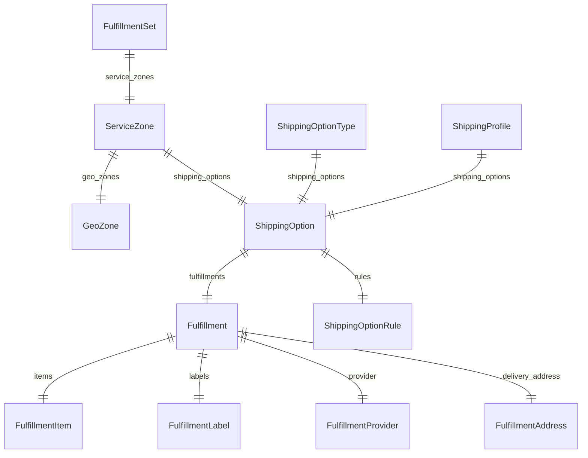

import { TypeList } from "docs-ui"

# Fulfillment Module Data Models Reference

This documentation provides a reference to the data models in the Fulfillment Module

## Relations Overview

## Type Aliases

- [GeoZoneSchema](../../fulfillment_models/types/fulfillment_models.GeoZoneSchema/page.mdx)
- [ServiceZoneSchema](../../fulfillment_models/types/fulfillment_models.ServiceZoneSchema/page.mdx)

## Data Models

- [Fulfillment](../../fulfillment_models/variables/fulfillment_models.Fulfillment/page.mdx)
- [FulfillmentAddress](../../fulfillment_models/variables/fulfillment_models.FulfillmentAddress/page.mdx)
- [FulfillmentItem](../../fulfillment_models/variables/fulfillment_models.FulfillmentItem/page.mdx)
- [FulfillmentLabel](../../fulfillment_models/variables/fulfillment_models.FulfillmentLabel/page.mdx)
- [FulfillmentProvider](../../fulfillment_models/variables/fulfillment_models.FulfillmentProvider/page.mdx)
- [FulfillmentSet](../../fulfillment_models/variables/fulfillment_models.FulfillmentSet/page.mdx)
- [GeoZone](../../fulfillment_models/variables/fulfillment_models.GeoZone/page.mdx)
- [ServiceZone](../../fulfillment_models/variables/fulfillment_models.ServiceZone/page.mdx)
- [ShippingOption](../../fulfillment_models/variables/fulfillment_models.ShippingOption/page.mdx)
- [ShippingOptionRule](../../fulfillment_models/variables/fulfillment_models.ShippingOptionRule/page.mdx)
- [ShippingOptionType](../../fulfillment_models/variables/fulfillment_models.ShippingOptionType/page.mdx)
- [ShippingProfile](../../fulfillment_models/variables/fulfillment_models.ShippingProfile/page.mdx)
