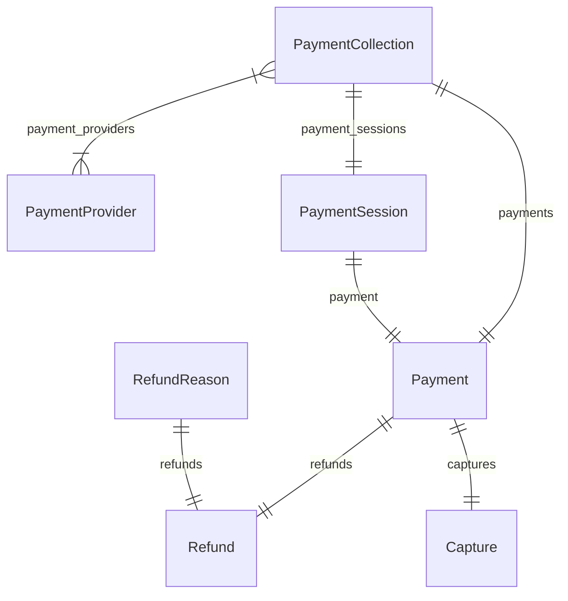

import { TypeList } from "docs-ui"

# Payment Module Data Models Reference

This documentation provides a reference to the data models in the Payment Module

## Relations Overview

## Data Models

- [AccountHolder](../../payment_models/variables/payment_models.AccountHolder/page.mdx)
- [Capture](../../payment_models/variables/payment_models.Capture/page.mdx)
- [Payment](../../payment_models/variables/payment_models.Payment/page.mdx)
- [PaymentCollection](../../payment_models/variables/payment_models.PaymentCollection/page.mdx)
- [PaymentProvider](../../payment_models/variables/payment_models.PaymentProvider/page.mdx)
- [PaymentSession](../../payment_models/variables/payment_models.PaymentSession/page.mdx)
- [Refund](../../payment_models/variables/payment_models.Refund/page.mdx)
- [RefundReason](../../payment_models/variables/payment_models.RefundReason/page.mdx)
