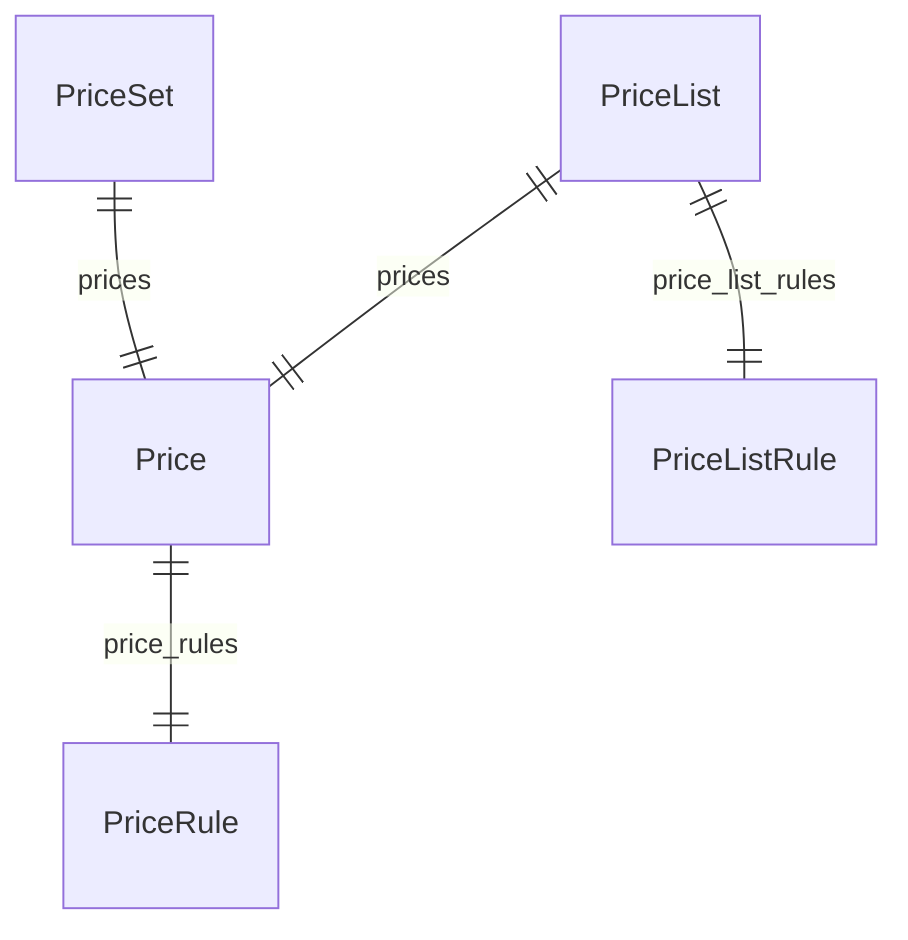

import { TypeList } from "docs-ui"

# Pricing Module Data Models Reference

This documentation provides a reference to the data models in the Pricing Module

## Relations Overview

## Data Models

- [Price](../../pricing_models/variables/pricing_models.Price/page.mdx)
- [PriceList](../../pricing_models/variables/pricing_models.PriceList/page.mdx)
- [PriceListRule](../../pricing_models/variables/pricing_models.PriceListRule/page.mdx)
- [PricePreference](../../pricing_models/variables/pricing_models.PricePreference/page.mdx)
- [PriceRule](../../pricing_models/variables/pricing_models.PriceRule/page.mdx)
- [PriceSet](../../pricing_models/variables/pricing_models.PriceSet/page.mdx)
