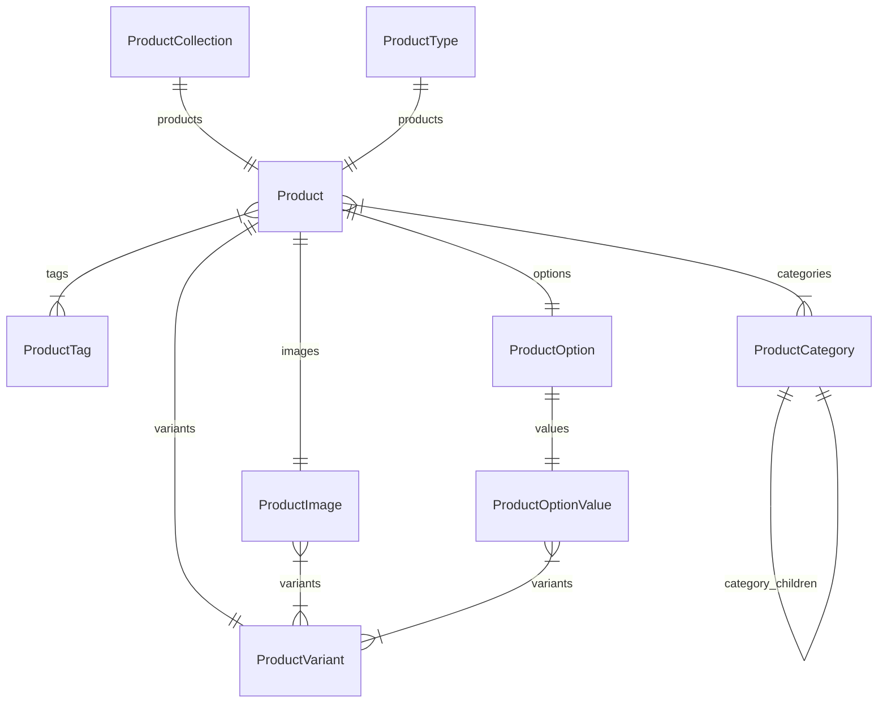

import { TypeList } from "docs-ui"

# Product Module Data Models Reference

This documentation provides a reference to the data models in the Product Module

## Relations Overview

## Data Models

- [Product](../../product_models/variables/product_models.Product/page.mdx)
- [ProductCategory](../../product_models/variables/product_models.ProductCategory/page.mdx)
- [ProductCollection](../../product_models/variables/product_models.ProductCollection/page.mdx)
- [ProductImage](../../product_models/variables/product_models.ProductImage/page.mdx)
- [ProductOption](../../product_models/variables/product_models.ProductOption/page.mdx)
- [ProductOptionValue](../../product_models/variables/product_models.ProductOptionValue/page.mdx)
- [ProductTag](../../product_models/variables/product_models.ProductTag/page.mdx)
- [ProductType](../../product_models/variables/product_models.ProductType/page.mdx)
- [ProductVariant](../../product_models/variables/product_models.ProductVariant/page.mdx)
- [ProductVariantProductImage](../../product_models/variables/product_models.ProductVariantProductImage/page.mdx)
