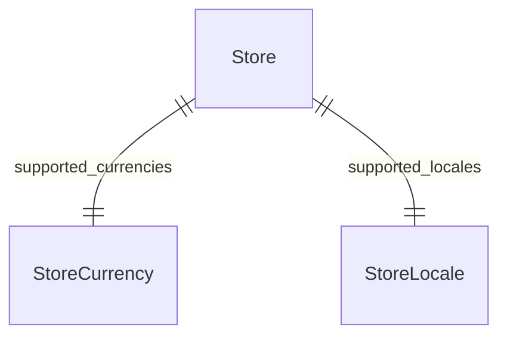

import { TypeList } from "docs-ui"

# Store Module Data Models Reference

This documentation provides a reference to the data models in the Store Module

## Relations Overview

## Data Models

- [Store](../../store_models/variables/store_models.Store/page.mdx)
- [StoreCurrency](../../store_models/variables/store_models.StoreCurrency/page.mdx)
- [StoreLocale](../../store_models/variables/store_models.StoreLocale/page.mdx)
